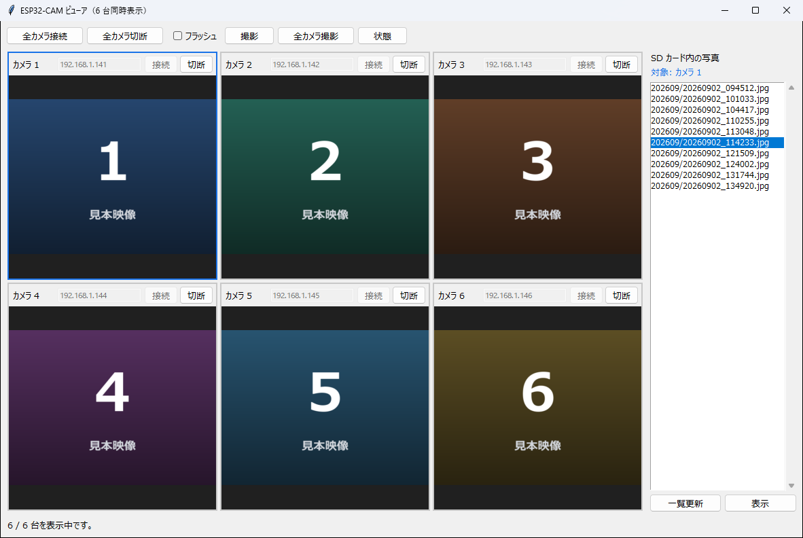
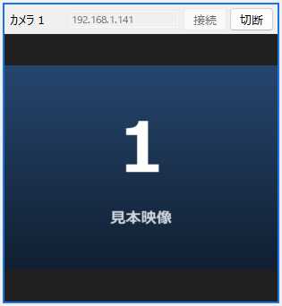
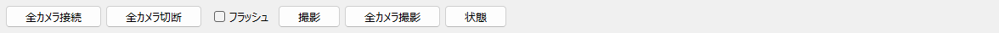
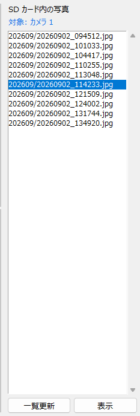
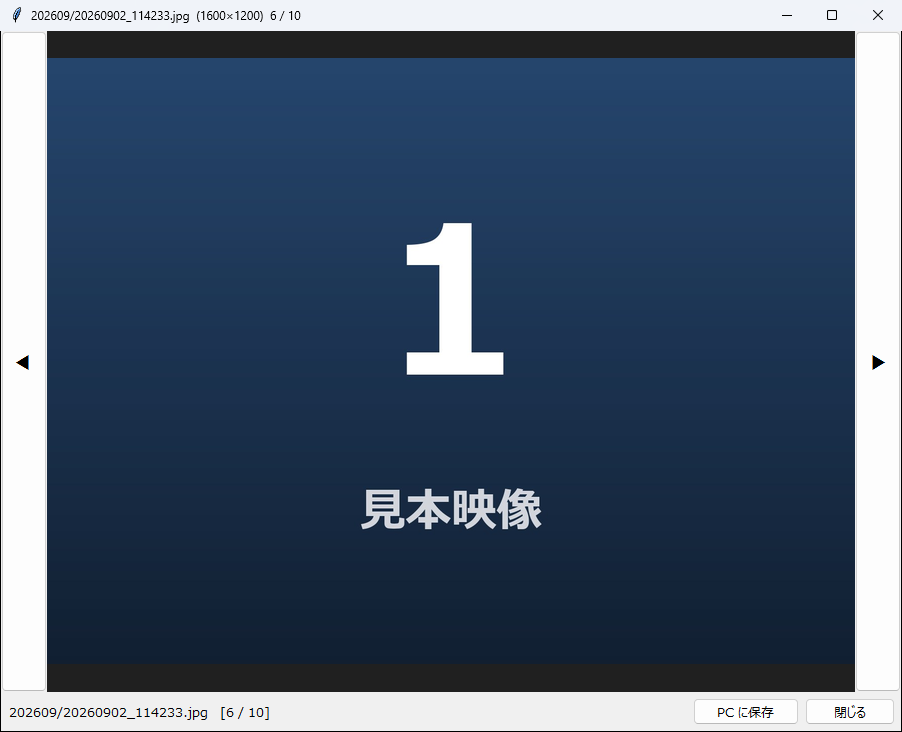

# ESP32-CAM ビューア 操作マニュアル

ESP32-CAM を **6 台まとめて画面に映し**、写真を撮り、SD カードに溜まった写真を
PC から見るソフトです。



---

## 1. できること

- **6 台のカメラの映像を同時に表示する**
- 選んだ 1 台、または **6 台まとめて写真を撮る**（保存先はカメラの SD カード）
- 撮るときに **フラッシュ（LED）を光らせる**
- SD カードに溜まった **写真を一覧して、PC の画面で見る**
- 見ている写真を **PC に保存する**
- カメラの **SD カードの空き容量と IP アドレスを調べる**

映像の録画はできません。保存できるのは写真（静止画）だけです。

### 使うまでに必要なもの

| | 内容 |
| --- | --- |
| カメラ | ESP32-CAM 6 台。電源が入っていること |
| ネットワーク | カメラと PC が**同じ WiFi につながっていること** |
| カメラの住所 | 各カメラの IP アドレス。SD カードの `config.txt` の `ip=` の値です |

初期値は カメラ 1 が `192.168.1.141` で、以降 1 ずつ増えて カメラ 6 が
`192.168.1.146` です。

---

## 2. 画面の見かた

| 場所 | 名前 | 何をする場所か |
| --- | --- | --- |
| 上部 | ツールバー | 全カメラの接続・切断、フラッシュ、撮影、状態 |
| 中央 | タイル 6 枚 | カメラ 1 台ぶん。IP 入力・接続・切断・映像 |
| 右 | SD カード内の写真 | 選んでいるカメラの写真一覧 |
| 下部 | 状態 | 今どうなっているか、操作の結果 |

**青い枠が付いているタイルが、いま操作の対象になっているカメラ**です。
右パネルの上にも「対象: カメラ 1」と出ます。

### タイル 1 枚の中身



| 部分 | 内容 |
| --- | --- |
| カメラ n | 何番目のカメラか。この番号は変わりません |
| IP の欄 | そのカメラの IP アドレス。**次回の起動時にも残ります** |
| ［接続］／［切断］ | そのカメラ 1 台だけをつなぐ／切る |
| 映像 | 映像。つながっていないときは「未接続」と出ます |

映像の部分に出る文字で、そのカメラの様子が分かります。

| 表示 | 意味 |
| --- | --- |
| 未接続 | まだつないでいません |
| 接続しています... | つなごうとしています |
| 映像を待っています... | つながりました。最初の映像が届くのを待っています |
| 接続できませんでした | つながりませんでした（住所違い、電源が入っていない、など） |
| 切断されました | つながっていたのに、途中で切れました |

---

## 3. 起動してカメラにつなぐ

デスクトップの **ESP32-CAM ビューア** のショートカットをダブルクリックします。

ショートカットが無い場合は、管理者に作ってもらってください
（`python tools/make_shortcut.py esp32cam --desktop`）。

**1. 各タイルの IP アドレスを確かめます。**

前回入力したものが入っています。初めて使うとき、またはカメラを入れ替えたときだけ
直してください。

**2. ［全カメラ接続］を押します。**

6 台まとめてつなぎます。数秒で各タイルに映像が出ます。
1 台だけつなぎたいときは、そのタイルの［接続］を押します。

つながらなかったカメラがあった場合、**6 台ぶんの結果が出そろってから、
まとめて 1 つのダイアログ**で知らされます。台数ぶんのダイアログが積み重なって
操作できなくなるのを防ぐためです。

**3. 終わったら［全カメラ切断］を押します。** ウィンドウを閉じても切断されます。

> **入力した IP アドレスは自動で保存されます。** 接続したとき、切断したとき、
> ウィンドウを閉じたときに保存されるので、次回は入力し直す必要はありません。

> ⚠ **映像の途中で切れたカメラは、ダイアログを出しません。**
> そのタイルに「切断されました」と出て、下の状態欄に理由が出ます。
> つなぎ直すには、そのタイルの［接続］を押してください。

---

## 4. 操作するカメラを選ぶ

**撮影・写真一覧・状態は、選んでいる 1 台に対して行われます。**

タイルの**どこでもクリック**すると、そのカメラが対象になります。青い枠が付き、
右パネルに「対象: カメラ n」と出ます。

> 対象を切り替えると、**右の写真一覧はいったん空になります。**
> 別のカメラの一覧をそのまま残すと、どのカメラの写真か取り違えるためです。
> 切り替えたら［一覧更新］を押し直してください。

---

## 5. 写真を撮る



| ボタン | 対象 |
| --- | --- |
| ［撮影］ | **選んでいる 1 台** |
| ［全カメラ撮影］ | **6 台すべて**（同時に指示します） |

［フラッシュ］にチェックを入れると、**カメラの LED を光らせて**撮ります。
暗い場所で使います。チェックは撮影ボタンを押すたびに効きます。

撮った写真は、**そのカメラの SD カードに保存されます**（PC ではありません）。
高解像度（UXGA）の JPEG です。

- ［撮影］のあとは、**写真一覧が自動で更新されます**
- ［全カメラ撮影］のあとは「4 / 6 台で撮影しました。」のように結果が出ます。
  失敗した台があれば、まとめて 1 つのダイアログで知らされます
- ファイル名の日時は、**PC の時計**から決まります

---

## 6. SD カードの写真を見る



**1. 見たいカメラのタイルをクリックして選びます。**

**2. ［一覧更新］を押します。**

そのカメラの SD カードにある写真が並びます。名前は
`202609/20260902_114233.jpg` の形で、**前半が年月のフォルダ、後半が撮った日時**です。

**3. 写真を選んで［表示］を押します**（ダブルクリックでも開きます）。

別のウィンドウで写真が開きます。



| 操作 | 動き |
| --- | --- |
| ［◀］［▶］、または `←` `→` キー | 一覧の前後の写真に切り替えます |
| ［PC に保存］ | いま見ている写真を PC に保存します |
| ［閉じる］ | ウィンドウを閉じます |

先頭・末尾では［◀］［▶］が押せなくなります。
ウィンドウの題名に「ファイル名（横×縦）6 / 10」と出るので、何枚目かが分かります。

**［PC に保存］の保存先**は、既定で `apps/esp32cam/downloads/` です
（実行ファイルの場合は exe と同じ場所）。別の場所も選べます。

---

## 7. カメラの状態を調べる

タイルを選んで［状態］を押すと、下の状態欄に出ます。

```
カメラ 1  SD カード: SDHC / 使用 812MB / 全体 15080MB  IP: 192.168.1.141
```

SD カードが入っていない、または認識されていない場合は
「SD カード: 未マウント」と出ます。**この状態では写真を撮っても保存されません。**

撮り続ける前に、空き容量をここで確かめてください。

---

## 8. ファイルの置き場所

`apps/esp32cam/` の中にあります（実行ファイルの場合は exe と同じ場所）。

| ファイル／フォルダ | 中身 |
| --- | --- |
| `settings.json` | 6 台ぶんの IP アドレス。自動で保存・復元されます |
| `downloads/` | ［PC に保存］で保存した写真 |

**撮った写真そのものは、カメラの SD カードにあります。** このソフトから消すことは
できません。片付けは SD カードを PC に挿して行ってください。

---

## 9. 困ったときは

| 症状 | 確かめること |
| --- | --- |
| 「接続エラー」が出る | カメラの電源が入っているか。PC とカメラが**同じ WiFi**か。IP が合っているか（SD カードの `config.txt` の `ip=`） |
| 一部のカメラだけつながらない | ダイアログにカメラ番号と IP が出ます。その台だけ電源や配線を確かめ、タイルの［接続］でつなぎ直す |
| 「映像を待っています...」のまま | つながってはいます。カメラ側の映像が始まるまで数秒待つ。変わらなければ［切断］→［接続］ |
| 途中で「切断されました」になる | WiFi が弱い、電源が不安定、カメラが再起動した。そのタイルの［接続］でつなぎ直す |
| ボタンが押せない | ほかの通信中です。終わるまで待ってください（下の状態欄に「〜しています...」と出ます） |
| 撮影しても写真が増えない | ［状態］で SD カードを確かめる。「未マウント」なら SD カードが認識されていません |
| 写真一覧が空 | ［一覧更新］を押したか。対象のカメラを切り替えると一覧は消えます |
| 別のカメラの写真が出ている気がする | 右上の「対象: カメラ n」を確かめて、［一覧更新］を押し直す |
| 写真が表示できない | 通信の途中で切れた可能性があります。もう一度［表示］を押す |

---

## 10. 気をつけること

- **撮影・写真一覧・状態は、青い枠が付いた 1 台だけが対象です。**
  操作する前に、対象が合っているかを右上の「対象: カメラ n」で確かめてください
- **写真はカメラの SD カードに保存されます。** PC に残したいものは、
  プレビューで開いて［PC に保存］を押してください
- **写真を消す機能はありません。** SD カードの片付けは手で行ってください
- **6 台の映像を同時に受けるので、WiFi と PC に負荷がかかります。**
  映像が途切れる場合は、使わないカメラを［切断］してください
- 録画（動画の保存）はできません
- ウィンドウを閉じると、すべての接続が切れ、IP アドレスが保存されます

---

*このマニュアルは `apps/esp32cam/MANUAL.md` です。*
*技術的な内部の説明と、カメラ側との通信の形は `README.md` にあります。*
