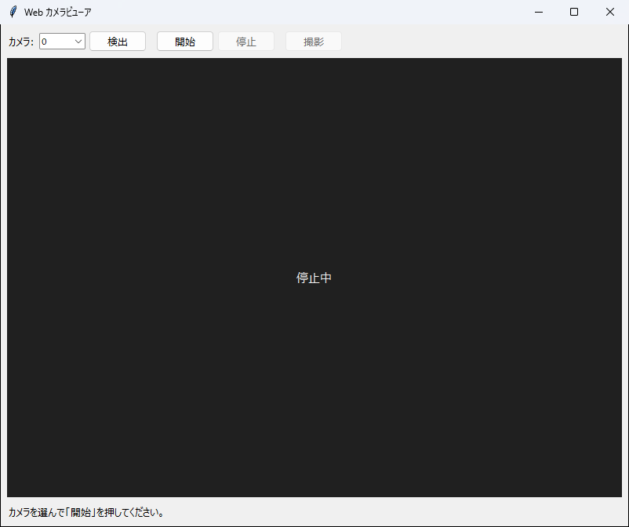

# Web カメラビューア 操作マニュアル

PC につないだ Web カメラの映像を画面に出し、その瞬間の静止画を保存するソフトです。



---

## 1. できること

- 接続されている **Web カメラの映像をリアルタイムに表示する**
- 表示中の映像から、**静止画を PNG で保存する**
- カメラが複数つながっているとき、**使えるカメラを調べて選ぶ**

映像の録画はできません。保存できるのは静止画だけです。

---

## 2. 起動する

デスクトップの **Web カメラビューア** のショートカットをダブルクリックします。

ショートカットが無い場合は、管理者に作ってもらってください
（`python tools/make_shortcut.py webcam --desktop`）。

> **`.py` ファイルを直接ダブルクリックしないでください。** 必要な部品が入っていない
> Python が使われて起動に失敗します。必ずショートカットから起動します。

終了はウィンドウ右上の「×」です。カメラは自動で解放されます。

---

## 3. 画面の見かた

| 場所 | 名前 | 何をする場所か |
| --- | --- | --- |
| 上部 | カメラ | 使うカメラの番号。複数つないでいるときに選びます |
| 上部 | ［検出］ | 使えるカメラを調べて、番号の候補を絞り込みます（数秒かかります） |
| 上部 | ［開始］／［停止］ | 映像の表示を始める／止める |
| 上部 | ［撮影］ | いま映っている画面を静止画で保存します |
| 中央 | 映像 | カメラの映像。止まっているときは「停止中」と出ます |
| 下部 | 状態 | 今どうなっているか、保存したファイルの場所 |

ボタンは**そのとき押せるものだけが押せます**。停止中は［停止］と［撮影］が
灰色になり、表示中は［開始］［検出］とカメラの選択が灰色になります。

---

## 4. 使い方

**1. ［検出］を押します。**

つながっているカメラを調べます。**数秒かかります。** 終わると、下の状態欄に
「利用できるカメラ: 0, 1」のように出て、［カメラ］の候補がその番号だけになります。

カメラが 1 台しかつながっていない場合は、この操作は省いてかまいません。

**2. ［カメラ］で番号を選びます。**

内蔵カメラは `0` のことが多く、後からつないだ USB カメラが `1` 以降になります。
どれがどれか分からないときは、順に選んで［開始］を押して確かめます。

**3. ［開始］を押します。**

映像が出ます。


**4. ［撮影］を押します。**

そのとき映っている画面が PNG で保存されます。保存先は下の状態欄に出ます。
何度でも押せます。

**5. 終わったら［停止］を押します。**

カメラが解放され、他のアプリ（Teams、Zoom など）から使えるようになります。
ウィンドウを閉じても解放されます。

---

## 5. 保存した写真の置き場所

`apps/webcam/captures/` に入ります（実行ファイルの場合は exe と同じ場所）。

ファイル名は**撮った日時**です。

```
captures/
    20260902_114233.png     ← 2026 年 9 月 2 日 11 時 42 分 33 秒
    20260902_114251.png
```

名前は秒までなので、**同じ 1 秒のうちに 2 回押すと、後のほうで上書きされます。**
連続して撮るときは 1 秒あけてください。

このソフトに**写真を消す機能はありません。** 片付けはエクスプローラーで行ってください。

---

## 6. 困ったときは

| 症状 | 確かめること |
| --- | --- |
| ［開始］でエラーが出る | 他のアプリ（Teams、Zoom、カメラアプリ）がそのカメラを使っていないか。閉じてからやり直す |
| ［検出］で「見つかりませんでした」 | カメラがつながっているか。USB を挿し直す。Windows の「カメラ」アプリで映るか確かめる |
| 真っ黒のまま映らない | カメラのプライバシーカバーが閉じていないか。番号が合っているか（別の番号で試す） |
| Windows が許可を求めてくる | 許可します。拒否した場合は［設定］→［プライバシーとセキュリティ］→［カメラ］で許可し直します |
| ［撮影］で「まだ映像を取得できていません」 | 映像が出るまで数秒待ってから、もう一度押します |
| 映像がカクつく | 他の重いアプリを閉じる。カメラの解像度が高すぎる場合があります |

---

## 7. 気をつけること

- **カメラは同時に 1 つのアプリしか使えません。** 会議アプリを開いたままだと
  開けません。逆に、このソフトで表示中は会議アプリからも使えません
- **表示中はカメラのランプが点きます。** 使い終わったら［停止］を押すか、
  ウィンドウを閉じてください
- **写真を消す機能はありません。** 溜まったら手で片付けてください
- 録画（動画の保存）はできません

---

*このマニュアルは `apps/webcam/MANUAL.md` です。*
*技術的な内部の説明は `README.md` にあります。*
