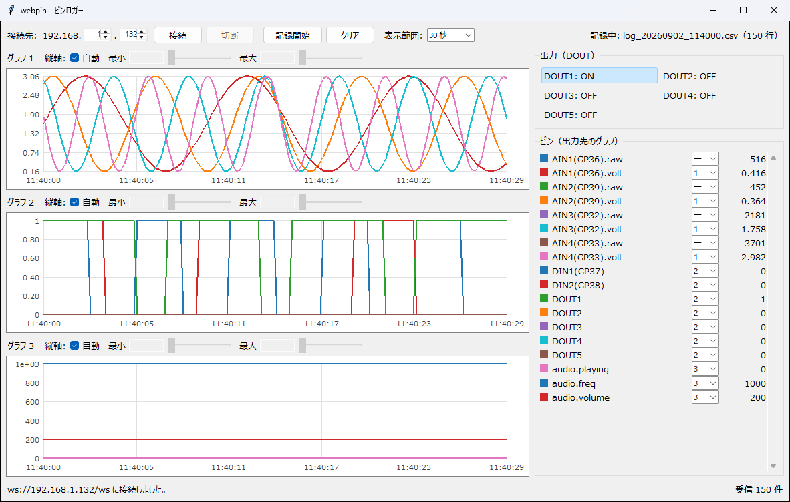
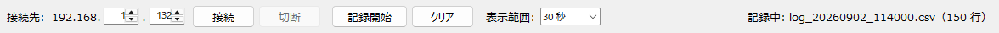
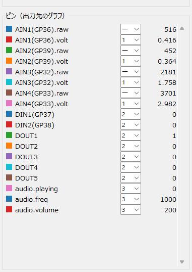

# webpin 操作マニュアル

マイコン（ESP32 / TTGO T-Display）のピンの状態を受け取り、**グラフで見ながら
CSV に記録する**ソフトです。マイコンの出力ピンを ON / OFF することもできます。



---

## 1. できること

- マイコンから **約 0.2 秒ごとに届くピンの値**を受け取り、折れ線グラフに描く
- 同じ値を **CSV に記録する**（Excel でそのまま開けます）
- マイコンの **出力ピン（DOUT）を ON / OFF する**
- 値の桁が違う系列を、**3 面のグラフに振り分けて**見る

### 使うまでに必要なもの

| | 内容 |
| --- | --- |
| マイコン | ESP32（TTGO T-Display）。プログラムが書き込まれ、電源が入っていること |
| ネットワーク | マイコンと PC が**同じ WiFi につながっていること** |
| マイコンの住所 | `192.168.○.○` の後ろ 2 つの数字（既定は `1` と `132`） |

マイコン側は WiFi につながると、`ws://<住所>/ws` で待ち受けます。

---

## 2. 用語

| 言葉 | 意味 |
| --- | --- |
| **系列** | グラフの 1 本の線。`AIN1(GP36).volt` のようにピンごとに付いた名前 |
| **AIN** | アナログ入力。電圧を測る端子。`.raw`（0〜4095 の生の値）と `.volt`（電圧）の 2 つが届きます |
| **DIN** | デジタル入力。ON / OFF だけの端子（0 か 1） |
| **DOUT** | デジタル出力。こちらから ON / OFF を指示できる端子 |

---

## 3. 起動して接続する

デスクトップの **webpin** のショートカットをダブルクリックします。

ショートカットが無い場合は、管理者に作ってもらってください
（`python tools/make_shortcut.py webpin --desktop`）。



**1. ［接続先］を合わせます。**

`192.168.` は固定で、**後ろの 2 つだけ**を入れます。既定は `1` と `132` で、
これは `ws://192.168.1.132/ws` を意味します。

つなぐネットワークが `192.168.2.x` なら、3 つ目を `2` にします。
どちらも 0〜255 の数字です。空欄や範囲外はエラーになります。

**2. ［接続］を押します。**

つながると、右のピン一覧と出力ボタンが**自動で並びます**（どんなピンがあるかは、
受信して初めて分かるためです）。画面右下に「受信 ○ 件」が増えていきます。

**接続が切れても、3 秒ごとに自動でつなぎ直します。** マイコンの電源を入れ直した
場合も、そのまま待っていれば復帰します。

**3. 終わったら［切断］を押します。** ウィンドウを閉じても切断されます。

---

## 4. 画面の見かた

| 場所 | 名前 | 何をする場所か |
| --- | --- | --- |
| 上部 | 操作の帯 | 接続先／接続・切断／記録開始・停止／クリア／表示範囲 |
| 左 | グラフ 1〜3 | 折れ線グラフ。縦に 3 面あります |
| 右上 | 出力（DOUT） | マイコンの出力ピンを ON / OFF するボタン |
| 右下 | ピン一覧 | 系列ごとに「どのグラフに出すか」と**最新値** |
| 下部 | 状態 | 接続の様子と、受信した件数 |
| 右上（帯） | 記録の状態 | 記録中のファイル名と行数 |

［クリア］はグラフと最新値の履歴を消します。**記録中の CSV はそのまま**で、
消えるのは画面に出ている分だけです。

---

## 5. グラフを見る

### 3 面あるのはなぜか

値の**桁が違う**ためです。電圧（0〜3.3）と生の値（0〜4095）を同じ軸に描くと、
電圧の線が下に張り付いて読めません。桁の近いものどうしを同じ面に集めます。

最初はこう振り分けられています（後から変えられます）。

| 系列 | 最初の場所 |
| --- | --- |
| `*.volt`（電圧） | グラフ 1 |
| `DIN*` / `DOUT*`（0 / 1） | グラフ 2 |
| `audio.*` など | グラフ 3 |
| `*.raw`（0〜4095） | 非表示 |

**系列を 1 つも置いていない面は畳まれ**、残りの面が高さを分け合います。

### 出す場所を変える

右のピン一覧で、系列ごとに番号を選びます。



| 選ぶもの | 意味 |
| --- | --- |
| `―` | 出さない（非表示） |
| `1` / `2` / `3` | そのグラフに出す |

左の四角は**グラフに描かれる線の色**です。そのまま凡例として使えます。
右の数字は**いま届いている最新値**で、グラフに出していない系列でも見られます。

### 横軸（表示範囲）

上の帯の［表示範囲］で切り替えます。**3 面すべてに同時に効きます。**

`10 秒` / `30 秒` / `1 分` / `5 分` / `全期間`

細かい動きを見るときは短く、全体の傾向を見るときは長くします。

### 縦軸の縮尺

各グラフの見出しにある［縦軸］で決めます。**グラフごとに別々**です。

| | 動き |
| --- | --- |
| ［自動］が入（既定） | 表示中の系列の最小・最大に合わせて、自動で伸び縮みします |
| ［自動］を外す | ［最小］［最大］を自分で決めます。数値の入力とバーの両方で調整できます |

**同じ縮尺で見比べたいときに［自動］を外します。** 例えば電圧を常に `0`〜`3.3` に
固定しておくと、値が動いても軸が動かないので変化の大きさが目で分かります。

外した時点の範囲が初期値として入ります。バーの範囲を超える値も、数値で入れれば
目盛りごと広がります。範囲からはみ出した線は枠の中に丸めて描かれます。

---

## 6. 出力（DOUT）を ON / OFF する

右上の［出力（DOUT）］のボタンを押すと、マイコンのその端子が切り替わります。
ボタンの文字が `DOUT1: ON` / `DOUT1: OFF` と変わります。

**ボタンの見た目は、マイコンが返してきた実際の状態に追従します。**
押しても実際に切り替わらなければ、ボタンは元に戻ります。マイコン側や別の PC から
変えられた場合も、こちらの表示に反映されます。

- **接続していないときは押せません**（灰色になります）
- ボタンは、マイコンから DOUT の情報が届いた時点で並びます

---

## 7. CSV に記録する

**1. ［記録開始］を押します。**

保存先を聞かれます。既定は `apps/webpin/logs/` の中の
`log_20260902_114000.csv`（開始した日時）です。そのままでかまいません。

**2. 記録が始まります。**

帯の右端に「記録中: log_20260902_114000.csv（150 行）」と出て、行数が増えていきます。

**3. ［記録停止］を押します。**

ファイルが閉じられ、「保存しました: ...（○ 行）」と出ます。
ウィンドウを閉じても記録は正しく閉じられます。

### CSV の形

`時刻` `経過秒` のあとに、系列が 1 列ずつ並びます。

```csv
時刻,経過秒,AIN1(GP36).raw,AIN1(GP36).volt,...,DIN1(GP37),...
2026-09-02 11:40:00.283,0.000,2048,1.65,...,0,...
```

- **Excel でそのまま開けます。** 日本語が化けない形式で書いています
- `時刻` は**受信した時点の PC の時計**です（マイコンは時刻を送ってきません）
- `経過秒` は、記録を始めた最初の 1 件を `0.000` とした秒数です

> ⚠ **列は、記録を始めた最初の 1 件で決まります。**
> 記録の途中で新しいピンが現れても、その列は記録されません。停止したときに
> 警告が出ます。全部のピンを記録したいときは、**受信が始まって値が並んでから
> ［記録開始］を押す**か、記録を始め直してください。

---

## 8. 困ったときは

| 症状 | 確かめること |
| --- | --- |
| 接続できない | マイコンの電源が入っているか。PC とマイコンが**同じ WiFi**か。接続先の数字が合っているか |
| 「接続しています...」のまま | 住所（後ろ 2 つの数字）を確かめる。マイコンを再起動する。3 秒ごとに再試行しているので、直れば自動でつながります |
| ピン一覧が「未受信」のまま | つながっていても値が届いていません。マイコン側のプログラムを確かめてください |
| グラフに線が出ない | ピン一覧でその系列が `―`（非表示）になっていないか。［表示範囲］が短すぎないか |
| 線が下に張り付いて読めない | 桁の違う系列が同じ面にあります。ピン一覧で別の番号に移してください |
| 出力ボタンが押せない | 接続していません。［接続］してから押してください |
| 押しても ON にならない | マイコン側でその端子が使えない可能性があります。ボタンは実際の状態に戻ります |
| CSV に無い列がある | 記録を始めた時点で、そのピンがまだ届いていませんでした。記録を始め直してください |
| 記録中にエラーが出た | 保存先が書き込めるか（USB メモリを抜いていないか）。記録は中断されます |

---

## 9. 気をつけること

- **接続していないと何も始まりません。** ピン一覧も出力ボタンも、受信して初めて並びます
- **記録の列は始めた瞬間に決まります。** 値が並ぶのを待ってから［記録開始］を押してください
- **［クリア］は画面だけを消します。** 記録中の CSV には影響しません
- **時刻は PC の時計です。** マイコン側の時刻ではありません
- グラフに残るのは**系列あたり 3000 点まで**です。古いものから消えます
  （記録した CSV には全部残ります）

---

*このマニュアルは `apps/webpin/MANUAL.md` です。*
*技術的な内部の説明と、マイコンから届く JSON の形は `README.md` にあります。*
