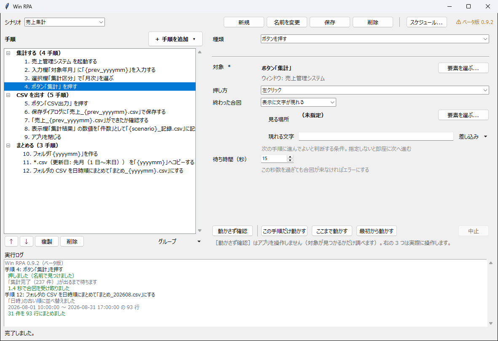
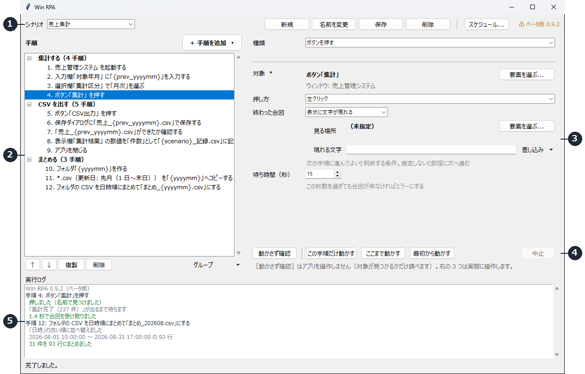
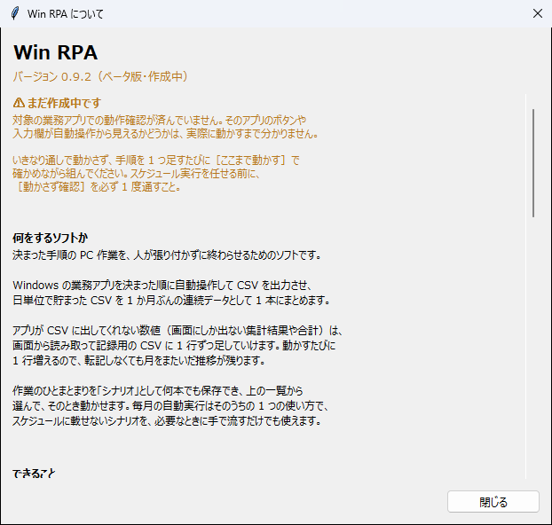
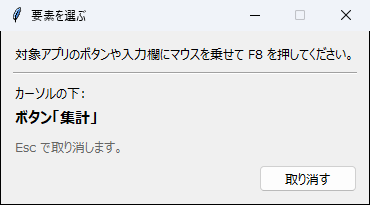
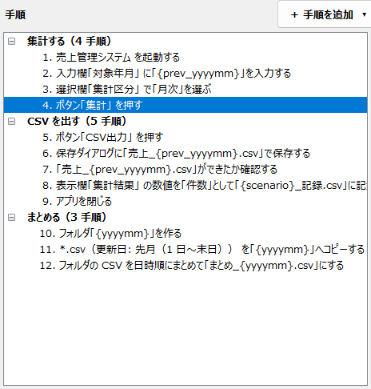
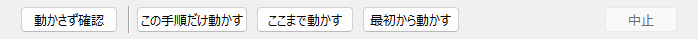
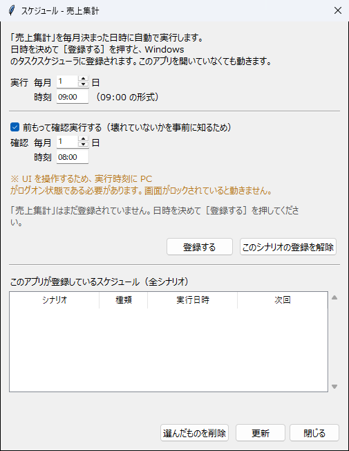

# Win RPA 操作マニュアル

決まった手順の PC 作業を、人が張り付かずに終わらせるためのソフトです。

このマニュアルは **Win RPA を使う人向け**です。プログラムを書く必要はありません。
画面のボタンとドロップダウンだけで、作業の手順を組み立てて動かせます。



> ⚠ **このソフトはまだベータ版です。**
> 対象の業務アプリでの動作確認が済んでいません。いきなり通しで動かさず、
> 手順を 1 つ足すたびに［ここまで動かす］で確かめながら組んでください。

---

## 1. できること

Win RPA は、次のことをまとめて 1 本の流れにできます。

- 業務アプリを起動し、ボタンを押す／文字を入力する／一覧から選ぶ
- アプリに CSV を出力させ、「名前を付けて保存」に応じる
- 出力先フォルダを年月日の型で自動的に作り、ファイルを振り分ける
- フォルダ内の CSV を**日時の古い順に並べて 1 本にまとめる**
- **画面にしか出ない数値**を読み取り、記録用の CSV に 1 行ずつ足していく
- 出来上がったファイルの中身を確認する（行数が足りているか）
- 作業のまとまりを選んで、そのとき 1 本だけ動かす
- 毎月決まった日時に動かしたいものは、Windows のタスクスケジューラに登録する

### 典型的な使い道

対象アプリが**毎日 1 本ずつ**吐き出す CSV を、月初に**1 か月ぶんの連続データ**へまとめる作業です。

```
日次/  ← 対象アプリが毎日 1 本ずつ出力
    売上_20260801.csv
    売上_20260802.csv     手順 1  フォルダを作る        → 日次/202608
    ...                   手順 2  ファイルをコピーする  → 31 本を入れる
    売上_20260831.csv     手順 3  CSV をまとめる        → 月次_202608.csv
```

### できないこと

- **条件分岐と繰り返しはありません。** 手順は上から下へ 1 本の直線で流れます。
- **ファイルを消す機能はありません。** 無人で動くものが誤って消すと、気づくのが
  1 か月後になるためです。片付けは手で行ってください。
- **画面がロックされていると動きません。** 人と同じように画面を操作するため、
  実行時に PC がログオン状態である必要があります。

---

## 2. 用語

このマニュアルで使う言葉は 3 つだけです。

| 言葉 | 意味 |
| --- | --- |
| **シナリオ** | 作業のひとまとまり。「売上集計」「在庫棚卸し」など。何本でも保存できます |
| **手順** | シナリオの中の操作 1 つ。「ボタンを押す」「フォルダを作る」など |
| **グループ** | 手順を束ねる見出し。長いシナリオを読みやすくするためだけのものです |

シナリオは何本でも持てます。**月次に限りません。** 毎週の締め処理でも、
頼まれたときだけ動かす作業でも、まとまりごとにシナリオを分けておいて、
必要になったものを選んで流す、という使い方ができます。

---

## 3. 起動と終了

### 起動する

デスクトップの **Win RPA** のショートカットをダブルクリックします。

ショートカットが無い場合は、管理者に作ってもらってください
（`python tools/make_shortcut.py win_rpa --name "Win RPA" --desktop`）。

> **`.py` ファイルを直接ダブルクリックしないでください。** 必要な部品が入っていない
> Python が使われて起動に失敗します。必ずショートカットから起動します。

### 終了する

ウィンドウ右上の「×」で閉じます。保存していない編集があると確認が出ます。

実行中に閉じようとすると「中止して閉じますか」と聞かれます。

### 起動しないとき

ダブルクリックしても何も起きない場合は、`apps/win_rpa/logs/起動エラー.log` に
原因が残っています。このファイルを管理者に渡してください。

---

## 4. 画面の見かた

画面は 5 つの区画に分かれています。



| 区画 | 場所 | 何をする場所か |
| --- | --- | --- |
| ① ツールバー | 上部 | シナリオの切り替えと、新規・保存・削除・スケジュール登録 |
| ② 手順一覧 | 左 | 手順の追加・並べ替え・グループ化。**上から順に実行されます** |
| ③ 手順の設定 | 右上 | 一覧で選んだ手順 1 つの設定。手順の種類によって項目が変わります |
| ④ 実行ボタン | 右下 | 4 種類。どこからどこまでを動かすかが違います（→ 8 章） |
| ⑤ 実行ログ | 下部 | 実行の経過。緑が成功、赤が失敗、黄色が注意 |

② と ③ の境目はドラッグで動かせます。手順の名前が長くて読めないときは、
境目を右へ動かして一覧を広げてください。

### 手順一覧の記号

| 表示 | 意味 |
| --- | --- |
| `⚠` | 未入力の項目があるか、前に必要な手順が足りていません。選ぶと理由が右に出ます |
| `（無効）` | この手順は飛ばされます |
| 太字の見出し | グループ。クリックすると折りたためます |

### 右上の版表示

ツールバーの右端に **⚠ ベータ版 0.9.2** と出ています。**クリックすると**、
このソフトが何をするものかと、気をつけるべきことをまとめた小窓が開きます。



---

## 5. はじめての 1 本を作る

対象アプリを操作する、いちばん短いシナリオを作ってみます。

> **練習用のダミーアプリがあります。** 本番の業務アプリでいきなり試すのが
> こわい場合は、`python tools/mock_target.py` で練習用のアプリを起動できます。
> 集計ボタンと CSV 出力ボタンだけを持った小さなアプリです。

### 手順

**1. 対象アプリを先に起動しておきます。**

Win RPA は、動いているアプリの画面を見てボタンの位置を覚えます。
先に起動しておかないと、指し示すものがありません。

**2. ［新規］を押して、シナリオ名を入力します。**

「売上集計」のように、作業の内容が分かる名前を付けます。

> シナリオ名に**空白を入れない**でください。あとでショートカットから
> 動かすときに、名前が途中で切れてしまいます。

**3. ［＋ 手順を追加］→［アプリを操作する］→［アプリを起動する］を選びます。**

右側に設定欄が出ます。［起動するアプリ］の［選ぶ...］を押すと、
デスクトップとスタートメニューにあるアプリの一覧が出るので、そこから選びます。
一覧に無ければ［ファイルを直接選ぶ...］で実行ファイルを指定します。

**4. ［＋ 手順を追加］→［ボタンを押す］を選びます。**

［対象］の［要素を選ぶ...］を押すと、Win RPA の画面が小さくなり、
「要素を選ぶ」という小窓が左上に出ます。

**5. 対象アプリの押したいボタンにマウスを乗せて、`F8` を押します。**

小窓の「カーソルの下:」に、いまマウスが乗っているものの名前が出ます。
**狙いのボタンの名前が出ていることを確かめてから** `F8` を押してください。
取り消すときは `Esc` です。



> Win RPA が覚えるのは**マウスの座標ではありません**。ボタンそのものの
> 識別情報（名前・種類・画面の中での位置）です。ウィンドウを動かしたり
> 大きさを変えたりしても、手順は壊れません。

**6. ［ここまで動かす］を押して、ここまでが正しく動くか確かめます。**

これで手順 1 から、いま選んでいる手順までが実際に動きます。
実行ログを見て、緑の `[ok]` が並んでいれば成功です。

**7. 手順 4〜6 を繰り返して、必要な操作を足していきます。**

**手順を 1 つ足すたびに［ここまで動かす］で確かめてください。**
全部組んでから通しで動かすと、どこが悪いのか分からなくなります。

**8. ［保存］を押します。**

**ここまでで、いつでも動かせる状態になっています。**
スケジュール登録は必須ではありません。

---

## 6. 手順の種類

［＋ 手順を追加］は 4 つの分類に分かれています。

### アプリを操作する

| 手順 | 何をするか |
| --- | --- |
| アプリを起動する | 一覧から選んだアプリを起動します |
| ボタンを押す | 押し方は［左クリック］［ダブルクリック］［右クリック］から選べます |
| 文字を入力する | 入力欄に文字を入れます。日付の差し込みが使えます |
| チェックを切り替える | チェックボックスを入／解除にします |
| 一覧から選ぶ | ドロップダウンやリストから項目を選びます |
| キーを押す | Enter で確定、Tab で次の欄、Ctrl+S で保存。**キーは一覧から選びます** |
| メニューから選ぶ | 「ファイル > エクスポート」のようにメニューバーを順にたどります |
| ウィンドウを前面に出す | 操作する画面を手前に出し、**以降の手順の対象をその画面に移します** |
| メッセージに応じる | 「よろしいですか？」の確認に答えます |
| アプリを閉じる | 起動したアプリを終了します |

**［メッセージに応じる］は無人実行で特に重要です。** 確認ダイアログに答える手順が
無いと、夜中に出たダイアログの前で止まったまま朝を迎えることになります。

- ［ダイアログの題名］を空にすると、**そのとき出ているメッセージ**が対象になります
- ［出ていなければ飛ばす］は既定で入。出ないこともあるダイアログに安全に対応できます

**［メニューから選ぶ］は、先に［アプリを起動する］か［ウィンドウを前面に出す］が
必要です。** どのアプリのメニューかが決まらないためで、無い場合はその場で理由が出ます。

### ファイルとフォルダ

| 手順 | 何をするか |
| --- | --- |
| 「名前を付けて保存」に応じる | 対象アプリが出す保存ダイアログにファイル名を入れて保存します |
| 「ファイルを開く」に応じる | 対象アプリが出す開くダイアログにファイル名を入れて開きます |
| フォルダを作る | 出力先フォルダを作ります。名前は年月日などの型から選びます |
| 保存先フォルダを選ぶ | **これ以降の手順の基準フォルダ**を切り替えます |
| ファイルをコピー／移動する | 出来上がった CSV を別フォルダへ運びます |

### 確認する

| 手順 | 何をするか |
| --- | --- |
| 画面の表示を確認する | 指定した場所に、想定の文字が出ているかを確かめます |
| ファイルができたか確認する | ファイルの有無と行数を確かめます。**空ファイルを次に渡さないための歯止め** |
| 画面を保存する | そのときの画面を画像として保存先に残します（証跡用） |
| 表示された数値を記録する | 画面にしか出ない数値を、記録用 CSV に 1 行足します（→ 11 章） |

### その他

| 手順 | 何をするか |
| --- | --- |
| CSV をまとめる | フォルダ内の CSV を日時順に 1 本にまとめます（→ 10 章） |
| しばらく待つ | 秒数を指定して待ちます。**合図で待てないときの最後の手段** |
| 別のプログラムを実行する | バッチファイルや別のツールを呼びます |
| 用意した処理を実行する | 標準の操作で足りないときの逃げ道。管理者に用意してもらいます |

---

## 7. 手順を組むときのコツ

### 終わった合図（待ち方）

多くの手順に［終わった合図］という項目があります。
**次の手順に進んでよい、と判断する条件**です。

| 選ぶもの | 意味 |
| --- | --- |
| 待たない | すぐ次へ進みます（既定） |
| ウィンドウが出る | 指定した題名のウィンドウが出るまで待ちます |
| 要素が現れる | 指定した要素が画面に出るまで待ちます |
| 要素が押せるようになる | ボタンが灰色から戻るまで待ちます |
| 表示に文字が現れる | 「集計完了」などの文字が出るまで待ちます |
| ファイルができる | 指定したファイルが出来るまで待ちます |

［待ち時間（秒）］を過ぎても合図が来なければ、その手順は失敗になります。

> **［しばらく待つ］より［終わった合図］を使ってください。**
> 秒数で待つと、当日の PC の混み具合によって必ずいつか足りなくなります。
> 合図で待てば、速いときは速く終わり、遅いときはちゃんと待ちます。

**［ウィンドウが出る］の題名は完全一致です。** 実行のたびに題名が変わるウィンドウ
（`売上管理 - 2026年08月` など）には使えません。その場合は［要素が現れる］
［表示に文字が現れる］を使ってください。

### 日付を自動で入れる（差し込み）

文字を入力する欄やファイル名には、**動かした日の日付を自動で入れられます**。
欄の横の［差し込み］ボタンから選びます。日付を毎月書き換える必要はありません。

| 選ぶもの | 8 月 28 日に動かすと |
| --- | --- |
| 今年月 | `202608` / `2026-08` |
| 前年月 | `202607` / `2026-07` |
| 今日 | `20260828` |
| 年 / 月 / 日 | `2026` / `08` / `28` |
| シナリオ名 | `売上集計` |
| 保存先フォルダ | そのときの保存先のフルパス |

**月初に前月分を集計する**作業では［前年月］を使います。
1 月に動かせば前年 12 月になるので、年またぎも自動で正しくなります。

### 手順を並べ替える・複製する・消す

手順一覧の下のボタンで操作します。

| ボタン | 何をするか |
| --- | --- |
| ↑ ↓ | 選んだ手順を 1 つ上／下へ動かします |
| 複製 | 選んだ手順を同じ設定でもう 1 つ作ります。似た操作を並べるときに使います |
| 削除 | 選んだ手順を消します（複数選んでいると確認が出ます） |

### グループで束ねる

手順が 20 を超えると一覧が読めなくなります。**グループ**にまとめてください。



| したいこと | やり方 |
| --- | --- |
| まとめる | 手順を選んで（Ctrl / Shift で複数選べます）［グループ］→［選んだ手順をまとめる...］ |
| 別のグループへ移す | 手順を選んで［グループ］→［別のグループへ移す...］ |
| グループから出す | 手順を選んで［グループ］→［グループから出す］ |
| 名前を変える | 見出しを選んで［グループ］→［グループ名を変更...］ |
| グループごと動かす | 見出しを選んで ↑ ↓ |
| 折りたたむ／展開する | 見出しをクリック、または［グループ］→［すべて折りたたむ］ |

**グループは見出しでしかありません。** 実行順は今までどおり上から 1 本の直線で、
分岐も繰り返しも起きません。長いシナリオを読めるようにするためだけのものです。

---

## 8. 4 つの実行ボタン

違いは **アプリを操作するかどうか** と、**どこからどこまでを動かすか** です。



| ボタン | アプリを操作 | 動かす範囲 | 使う場面 |
| --- | --- | --- | --- |
| 動かさず確認 | **しない** | 全部 | 壊れていないかの点検。対象が見つかるかだけ調べます |
| この手順だけ動かす | する | 選んだ手順 1 つだけ | 直した手順 1 つだけを試したいとき |
| ここまで動かす | する | 最初から、選んだ手順まで | **組み立て中はこれ** |
| 最初から動かす | する | 全部 | 本番と同じ |

実行中は［中止］が押せるようになります。

### ［動かさず確認］の使いどころ

アプリを一切操作せず、**手順が指しているボタンや入力欄が今も見つかるか**だけを
調べます。対象アプリが更新されて壊れていないかの点検に使います。

- ファイルは作られません（フォルダの作成もしません）
- クリップボードにも触りません
- どのファイルに何行目として書き込む予定かは、ログに出ます

**スケジュール実行を任せる前に、必ず 1 度［動かさず確認］を通してください。**

### ［この手順だけ動かす］の注意

**前の手順を動かしません。** 対象アプリは自分で開いておいてください。
また、このときだけ未入力のチェックも**その手順しか見ません**。
組み立て途中の他の手順が埋まっていなくても、今直した 1 つを試せます。

---

## 9. フォルダとファイルの指定

**フォルダ名やファイル名は打ちません。［型］から選びます。**

### フォルダ名の型

| 選ぶもの | 出来上がる名前 |
| --- | --- |
| 年月 | `202608` |
| 年月（区切りあり） | `2026-08` |
| 年月日 | `20260828` |
| 年 の下に 月 | `2026\08`（フォルダが 2 段になります） |
| 前月 | `202607` |
| シナリオ名＋年月 | `売上集計_202608` |

選ぶと、その下に**実際に出来上がるフルパス**が出ます。既にあるかどうかも
そこに出るので、毎月同じフォルダに上書きしていないかを確認できます。

先頭に文字を足したい場合は、欄に直接書き足せます（`月次_{yyyymm}` など）。

### 保存先は実行中に切り替わる

［フォルダを作る］［保存先フォルダを選ぶ］を通すと、**それ以降の手順の保存先が
切り替わります**。ファイル名だけを書いた項目（`売上_{yyyymm}.csv` など）は、
その時点の保存先を基準に解決されます。

### まとめて扱うファイルの型

［ファイルをコピー／移動する］の［対象のファイル］も、型から選びます。

| 選ぶもの | 対象 |
| --- | --- |
| すべてのファイル | フォルダの中の全部 |
| CSV すべて | `*.csv` |
| Excel すべて | `*.xlsx` |
| テキストすべて | `*.txt` |
| 今月分の CSV | 名前に `202608` を含む CSV |
| 前月分の CSV | 名前に `202607` を含む CSV |

選ぶと、その下に **今そこに何件あるか** が出ます。0 件のまま気づかずに
組んでしまうのを防ぐためです。

### 更新日で絞る

ファイル名に日付が入っていない出力もあります。そのときは［更新日で絞る］で、
**ファイルの更新日時**を見て対象を選びます。ここも日付は打たず、型から選びます。

| 選ぶもの | 8 月 31 日に動かすと |
| --- | --- |
| 指定なし（すべて） | 絞りません（既定） |
| **先月（1 日〜末日）** | 7/1 00:00 〜 7/31 23:59 |
| 今月（1 日〜今日） | 8/1 00:00 〜 8/31 23:59 |
| 今日 / 昨日 | 8/31 / 8/30 の 1 日ぶん |
| 直近 7 日 / 直近 30 日 | 8/25 〜 8/31 / 8/2 〜 8/31 |
| 期間を指定する | 年・月・日を選んだ範囲（両端を含みます） |

選ぶと、その下に**今日動かすといつからいつまでになるか**が出ます。
「先月」を選んで 7 月になっているかを、その場で目で確かめられます。

年またぎ（1 月に「先月」＝前年 12 月）とうるう年の末日も自動で解決されます。
名前と更新日の両方で絞りたいときは、両方を指定してください。

### コピーの安全装置

| 項目 | 既定 | 意味 |
| --- | --- | --- |
| 同じ名前のとき | **飛ばす** | 行き先に同じ名前があっても止まらず、かつ黙って消しません |
| 最低件数 | 1 | これを下回ると失敗にします。0 件を黙って次に渡さないため |

［上書きする］を選ぶと行き先のファイルは消えます。既定のままにしておくことを
おすすめします。

---

## 10. CSV をまとめる

**日単位で貯まった CSV を、1 か月ぶんの 1 本の連続データにする**手順です。

［まとめる場所］の中の CSV を**全部**読み込み、**日時の古い順に並べ替えて**
1 つにまとめ、**同じフォルダに**置きます。

| 項目 | 内容 |
| --- | --- |
| まとめる場所 | ［参照...］で選びます。空にすると、手前の［フォルダを作る］で作った場所 |
| できあがる名前 | ［型］から選びます（`まとめ_{yyyymm}.csv` など）。`.csv` は自動で付きます |
| 元ファイル名の列を足す | どの CSV から来た行かを、末尾の列に残します |
| 最低行数 | これを下回ると失敗にします |

### 並べ替えについて

**並べ替えに使う列は自動で見つかります。** 見出しの**先頭 4 列**の中から、
名前に「日時」「日付」「年月日」「date」などが入っている列を先に試し、
無ければ中身を読んで日時として通るかで判断します。使った列は実行ログに出ます。

読める日時の書き方は次のとおりです。ファイルごとに違っていても混ぜて並べられます。

```
2026-08-28 10:30:00    2026/8/5 9:07      2026-08-28T10:30:00
2026-08-28 10:30:00.5  20260828 07:05:00  20260828070500
2026年8月28日 14時05分
2026-08-28   2026/8/5   20260828   2026年8月28日   2026.08.28   （日付だけも可）
2026-08      2026/08                                           （年月だけも可）
```

- 日時として読めなかった行は、**捨てずに末尾**へ回します
- 先頭付近に日時の列が無ければ、読み込んだ順のままにして警告を出します
- **出来上がったファイル自身は対象から除きます。** 2 回目に動かしても行は倍になりません

### まとまった結果の確認

実行ログに**まとまった期間**が出ます。1 か月ぶんが揃っているかを、
ファイルを開かずに確かめられます。

```
[info]   「日時」の古い順に並べ替えました
[info]   2026-08-01 10:00:00 〜 2026-08-31 17:00:00 の 93 行
[ok]    31 件を 93 行にまとめました（...\202608\月次_202608.csv）
```

> **［CSV をまとめる］には、まとめる場所が必要です。**
> ［まとめる場所］が空で、手前に［フォルダを作る］も［保存先フォルダを選ぶ］も
> 無い場合、一覧に ⚠ が付き、実行しても対象アプリを起動する前に止まります。

---

## 11. 表示された数値を記録する

**対象アプリが CSV に出してくれない値**（画面にしか出ない集計結果、合計金額、
件数）を拾って、記録用の CSV の**末尾に 1 行足す**手順です。

動かすたびに 1 行増えるので、月をまたいでも 1 本の連続データになります。

```
日時,シナリオ,項目,値,元の表示
2026-09-01 10:00:03,売上集計,件数,237,集計完了（237 件）
2026-09-01 10:00:06,売上集計,合計金額,1234567,"1,234,567"
2026-10-01 10:00:04,売上集計,件数,251,集計完了（251 件）
```

| 項目 | 内容 |
| --- | --- |
| 数値が出ている場所 | ピッカー（`F8`）で選びます |
| 読み取り方 | 下の表を参照 |
| 項目名 | 「項目」列に入る名前。1 つのファイルに複数の値を記録できます |
| 記録するファイル | ［型］から選びます。**毎回同じファイルに足す**のが基本です |
| 数値だけを取り出す | 「1,234 件」から `1234` を取り出します（既定は入） |

### 読み取り方の選び方

| 読み取り方 | 何をするか | 使う場面 |
| --- | --- | --- |
| 表示から読む | 画面から文字を読みます。操作しません | **まずこれ** |
| 選択してコピーする | 対象を選んで Ctrl+C し、クリップボードから受け取ります | 表示から読めない欄 |
| クリックしてからコピーする | クリックしてから Ctrl+C（全選択しません） | 一覧のセル |

一覧（表）のセルで［選択してコピーする］を使うと**表ぜんぶがコピーされます**。
セルを 1 つだけ取りたいときは［クリックしてからコピーする］を選んでください。

> **コピーを使うとクリップボードの中身が入れ替わります。**
> 人が作業中の PC で手動実行するときは注意してください。
> なお［動かさず確認］ではクリップボードに触りません。

### 覚えておくこと

- 列は固定です（日時 / シナリオ / 項目 / 値 / 元の表示）。**先頭が日時**なので、
  出来たファイルはそのまま［CSV をまとめる］の並べ替えに乗ります
- `元の表示` に読み取った文字がそのまま残ります。`1234` が「1,234 件」から
  来たのか別の数字から来たのかを、後から確かめられます
- **数値が取り出せなければ失敗になります。0 では埋めません。**
  処理が終わる前に読んだ、指す場所を間違えた、を黙って記録しないためです
- 記録に必要な列が無いファイルを指していたら、**書かずに止まります**
- 欄の下に**今そのファイルが何行あるか**が出ます。指定を間違えて毎回別の
  ファイルを作っていることに、実行する前に気づけます

---

## 12. 動かす

動かし方は 4 通りあります。

| やりたいこと | やり方 |
| --- | --- |
| 今すぐ 1 本動かす | 一覧でシナリオを選び［最初から動かす］ |
| 動くか先に確かめる | 同じく選んで［動かさず確認］ |
| 画面を開かずに動かす | 専用のショートカットをダブルクリック（下記） |
| 毎月決まった日時に任せる | ［保存］→［スケジュール...］（→ 13 章） |

### 画面を開かずに動かす

よく動かすシナリオは、そのシナリオを指すショートカットを作っておくと
**ダブルクリックだけで走ります**。画面は出ず、結果は `logs` フォルダに残ります。

管理者に次のように作ってもらってください。

```powershell
python tools/make_shortcut.py win_rpa --name "売上集計を実行" --args "--run 売上集計" --desktop
```

シナリオごとに名前を変えて作れば、デスクトップに「作業ごとのボタン」が並びます。

> シナリオ名に**空白を含めないでください**。名前が途中で切れて動かなくなります。

---

## 13. スケジュールに登録する

**スケジュール登録は必須ではありません。** 毎月決まった日時に人手を介さず
動かしたいときだけ使います。



### 登録する

1. シナリオを［保存］します
2. ツールバーの［スケジュール...］を押します
3. ［実行］に、毎月何日の何時に動かすかを入れます（時刻は `09:00` の形式）
4. ［前もって確認実行する］にチェックを入れ、**本番より前の日時**を入れます
5. ［登録する］を押します

Windows のタスクスケジューラに登録され、**このアプリを開いていなくても動きます。**

### 登録されるもの

| タスク | 内容 |
| --- | --- |
| 実行 | 本番。CSV を出力して結合します |
| 確認 | 確認実行。操作せず、対象が見つかるかだけ調べます |

**確認を本番より前の日時にしておいてください。** 対象アプリの更新で手順が
壊れていた場合に、当日より前に気づけます。月 1 回しか動かないので、
当日に初めて知るのでは遅すぎます。

### 一覧と削除

画面下部に**全シナリオの登録一覧**が出ます（シナリオ／種類／実行日時／次回）。
行を選んで［選んだものを削除］で個別に消せます。開いているシナリオ以外のものも
消せるので、取り残されたタスクをここで片付けられます。

［このシナリオの登録を解除］は、開いているシナリオの登録（実行・確認の両方）を
まとめて消します。

### 覚えておくこと

- **画面がロックされていると動きません。** 実行時刻に PC がログオン状態である
  必要があります。ここは自動化しきれない部分です
- 登録済みのスケジュールがあっても、**手で動かすことはいつでもできます**。
  両者は独立していて、同じシナリオを指しているだけです
- **シナリオを削除・改名すると、スケジュールも自動で追従します。**
  削除なら解除、改名なら同じ日時で新しい名前に付け替えられます

---

## 14. ログとファイルの置き場所

Win RPA のフォルダ（`apps/win_rpa`、exe の場合は exe の隣）の中にあります。

| フォルダ | 中身 |
| --- | --- |
| `scenarios/` | 保存したシナリオ |
| `work/` | 対象アプリが出力した CSV と、まとめた結果 |
| `logs/` | 実行ログ（`2026-09/` のように月ごと）と、失敗時の画面 |

### 実行ログの読み方

| 印 | 色 | 意味 |
| --- | --- | --- |
| `[step]` | 黒 | これから動かす手順 |
| `[ok]` | 緑 | 成功しました |
| `[info]` | 灰 | 経過の説明（何件見つかった、どの列で並べ替えた、など） |
| `[warn]` | 黄 | 注意。動いてはいますが、確かめたほうがよいことです |
| `[error]` | 赤 | 失敗しました。ここで止まります |

ログの 1 行目には Win RPA の版が出ます。不具合を報告するときは、
**この行を含めてログをそのまま**渡してください。

**実行に失敗すると、そのときの画面が `logs` に画像として残ります。**
何が表示されていて止まったのかを、後から見られます。

---

## 15. 困ったときは

| 症状 | 確かめること |
| --- | --- |
| ダブルクリックしても何も起きない | `logs/起動エラー.log` を見る。管理者に渡す |
| 「対象が見つかりません」で失敗する | 対象アプリが起動しているか。アプリが更新されていないか。［動かさず確認］で全手順を点検する |
| 手順に ⚠ が付いている | その手順を選ぶと、右側に未入力の項目か不足している前提が出る |
| 「先に〜の手順が必要です」と出る | ［CSV をまとめる］の前に［フォルダを作る］か［保存先フォルダを選ぶ］を置く。または［まとめる場所］を直接指定する |
| 待ちきれずに失敗する | ［待ち時間（秒）］を延ばす。［終わった合図］を「待たない」以外にする |
| ダイアログの前で止まる | ［メッセージに応じる］の手順を足す。題名を空にすると出ているものが対象になる |
| コピーが 0 件で失敗する | ［対象のファイル］の下に出る件数を見る。［更新日で絞る］の範囲が合っているか |
| まとめた CSV の行が倍になった | 起きません（出来上がったファイル自身は対象から除かれます）。別のフォルダを指していないか確認する |
| 記録用 CSV の行が増えない | ［記録するファイル］の欄の下に出る行数を見る。日付で名前が変わる型を選んでいないか |
| スケジュールの時刻が来ても動かない | その時刻に PC がログオン状態だったか。画面がロックされていなかったか |
| 「メニューが見つかりません」 | 手前に［アプリを起動する］か［ウィンドウを前面に出す］があるか |

### それでも直らないとき

次の 3 つをそろえて管理者に渡してください。

1. **実行ログ**（`logs/` の中の、失敗した日時のファイル）
2. **失敗時の画面**（同じく `logs/` の中の画像）
3. **シナリオ名**と、**何番目の手順で失敗したか**

---

## 16. 気をつけること

- **いきなり通しで動かさないでください。** 手順を 1 つ足すたびに
  ［ここまで動かす］で確かめながら組んでください
- **スケジュールに載せる前に［動かさず確認］を必ず 1 度通してください**
- **スケジュール実行には、その時刻に PC がログオン状態である必要があります。**
  画面がロックされていると動きません
- **ファイルを消す機能はありません。** 片付けは手で行ってください
- **数値の記録で「コピー」を選ぶと、その手順のあいだにクリップボードの中身が
  入れ替わります。** 人が作業中の PC で手動実行するときは注意してください
- **実行中は対象アプリを触らないでください。** Win RPA が人と同じように
  画面を操作しているため、割り込むと手順がずれます
- **対象アプリが更新されたら、［動かさず確認］で点検してください。**
  ボタンの名前が変わると手順が見つけられなくなります

---

## 付録 A. 押せるキーの一覧

［キーを押す］で選べるキーです。書き方を覚える必要はなく、一覧から選びます。

| 分類 | 選べるもの |
| --- | --- |
| 決定・移動 | Enter（決定） / Tab（次の項目へ） / Esc（取り消し） / スペース |
| 文字を消す | BackSpace / Delete |
| カーソル | ↑ ↓ ← → / Home（先頭へ） / End（末尾へ） / PageUp / PageDown |
| Ctrl 系 | Ctrl+A（すべて選択） / Ctrl+C（コピー） / Ctrl+V（貼り付け） / Ctrl+X（切り取り） / Ctrl+Z（元に戻す） |
| Ctrl 系（操作） | Ctrl+N（新規） / Ctrl+O（開く） / Ctrl+S（保存） / Ctrl+P（印刷） / Ctrl+F（検索） |
| ファンクション | F1 〜 F12（F5 は更新） |
| その他 | Alt+F4（閉じる） |

［回数］を指定すると、同じキーを続けて押せます（Tab を 3 回、など）。

---

## 付録 B. 差し込みの一覧

文字を入力する欄やファイル名で、［差し込み］ボタンから選べます。

| 表示 | 入る値（2026 年 8 月 28 日の場合） |
| --- | --- |
| 今年月（202608） | `202608` |
| 今年月（2026-08） | `2026-08` |
| 前年月（202607） | `202607` |
| 前年月（2026-07） | `2026-07` |
| 年（2026） | `2026` |
| 月（08） | `08` |
| 日（28） | `28` |
| 今日（20260828） | `20260828` |
| シナリオ名 | `売上集計` |
| 保存先フォルダ | そのときの保存先のフルパス |

---

## 付録 C. コマンドから動かす

管理者向けです。リポジトリ直下から実行します。

```powershell
python apps/win_rpa/main.py                          # 画面を開く
python apps/win_rpa/main.py --run 売上集計            # シナリオ 1 本を無人実行
python apps/win_rpa/main.py --run 売上集計 --dry-run  # 操作せず確認だけ

python apps/win_rpa/pick.py                          # 要素ピッカー単体（下調べ用）
python tools/mock_target.py                          # 練習用ダミーアプリ
```

`--run` は画面を出さずに実行し、結果を `logs/<年-月>/` に残します。
終了コードは、成功が `0`、手順の失敗が `1`、シナリオが見つからない場合が `2` です。

---

*Win RPA 0.9.2（ベータ版）／ このマニュアルは `apps/win_rpa/MANUAL.md` です。*
*技術的な内部の説明は `README.md`、設計の経緯は `DEVLOG.md` にあります。*
